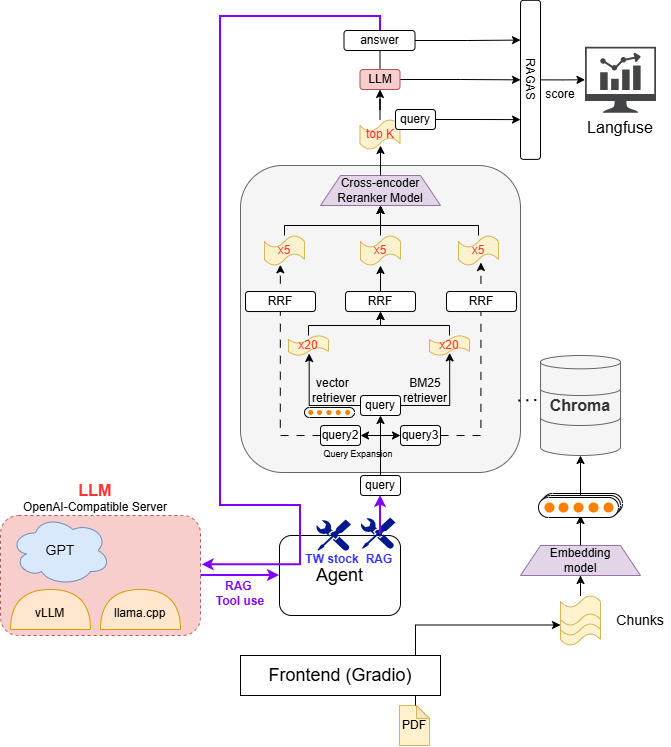

# ai-agent

Gradio 聊天介面 + LangChain 工具型 agent，支援台股報價、台灣天氣查詢與 PDF / TXT 文件索引（RAG）。
使用 Langfuse Dashboard。



## 功能

- **台股報價**：即時查詢 TWSE MIS API（支援股票代號、中文名稱、加權指數）
- **台灣天氣**：查詢中央氣象署觀測站資料（支援縣市名稱或地點）
- **RAG 文件問答**：上傳 PDF / TXT → 向量索引 → 向量資料庫：Query → 查詢擴展 → metadata 過濾 (作者) → 混合檢索（語意 + BM25, with RRF）→ CrossEncoder Reranker → top-K → LLM 合成回答
- **對話記憶**：維持最近 3 輪對話上下文
- **RAG 評估**（選用）：透過 RAGAS + Langfuse 追蹤 Faithfulness、AnswerRelevancy

## 環境
Python 3.11

```bash
pip install -r requirements.txt
```

## 設定

### `.env`

參考 `.env.example`，在專案根目錄新增 `.env` 並填入金鑰。

- `CWA_API_KEY`：至 [中央氣象署開放資料平台](https://opendata.cwa.gov.tw/) 註冊後取得。

### `config.yaml`

各種設定

## 使用本地模型

### vLLM

```bash
vllm serve <model> --port 8000 --enable-auto-tool-choice --tool-call-parser llama3_json
```

`config.yaml`：

```yaml
agent:
  llm:
    provider: openai
    model: 不看
    base_url: http://localhost:8000/v1
```

### llama.cpp

```bash
llama-server -m <model>.gguf -np 1 -c 8192 --jinja --verbose
```

`config.yaml`：

```yaml
agent:
  llm:
    provider: openai
    model: 不看
    base_url: http://localhost:8080/v1
```

## Langfuse（選用）

Langfuse 用於追蹤 RAG 評估指標（Faithfulness、AnswerRelevancy）。

**1. 啟動本地 Langfuse 伺服器**

```bash
docker compose up -d
```

**2. 設定環境變數**（加入 `.env`）

```
LANGFUSE_SECRET_KEY=sk-lf-...
LANGFUSE_PUBLIC_KEY=pk-lf-...
LANGFUSE_HOST=http://localhost:3000
```

**3. 啟用評估**（`config.yaml`）

```yaml
evaluator:
  enabled: true
```

Langfuse 儀表板預設位於 http://localhost:3000。

## 啟動

```bash
python main.py
```
